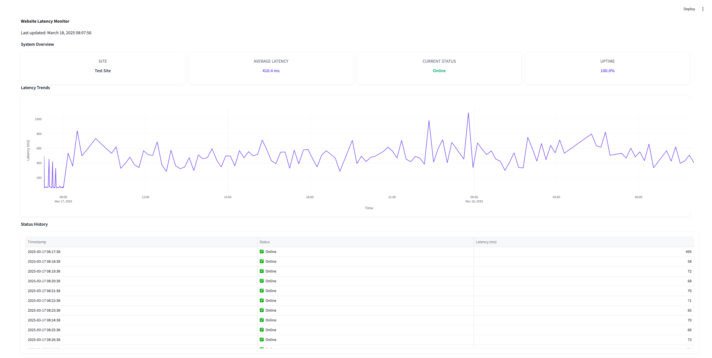
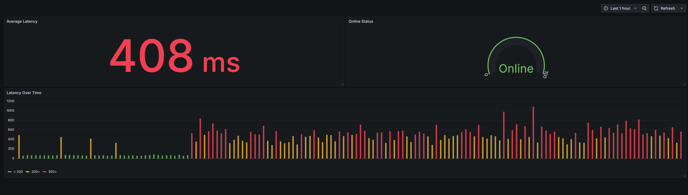
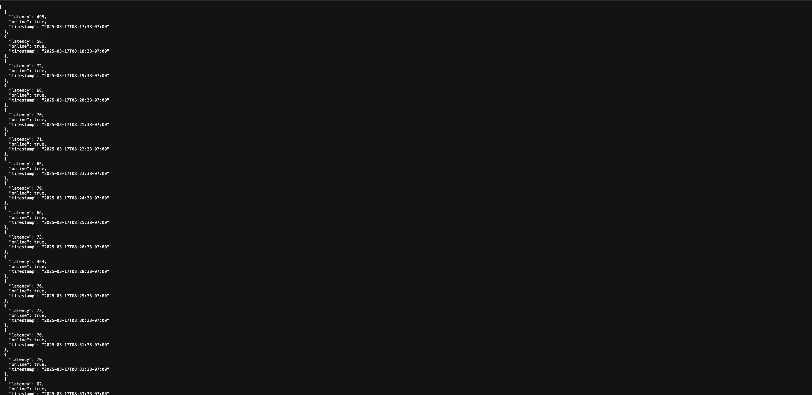

# Site Uptime Monitor

A Go-based application to track website uptime and latency, with dashboards built using Streamlit and Grafana.

 

## Overview
This project monitors the uptime and latency of a web application, storing results in a SQLite database (`site_status.db`). It provides:
- A Go backend with an API endpoint (`/data`) serving JSON data.
- A Streamlit dashboard (Python) to visualize API data.
- A Grafana dashboard to analyze SQLite data with advanced tools.

 

## Features

### Streamlit Dashboard
- Built with the [Streamlit](https://streamlit.io/) Python framework.
- Visualizes JSON data from `http://localhost:8080/data` in a simple, interactive UI.
- Screenshot:  
  

 

### Grafana Dashboard
- Uses [Grafana](https://grafana.com/), an open-source visualization platform.
- Connects to `site_status.db` for detailed metrics (e.g., latency trends, uptime stats).
- Requires Docker to run on port `3000`—see setup below.
- Screenshot:  
  

 

## Golang API Endpoint 

- localhost:8080/data
- Screenshot:
      

 
